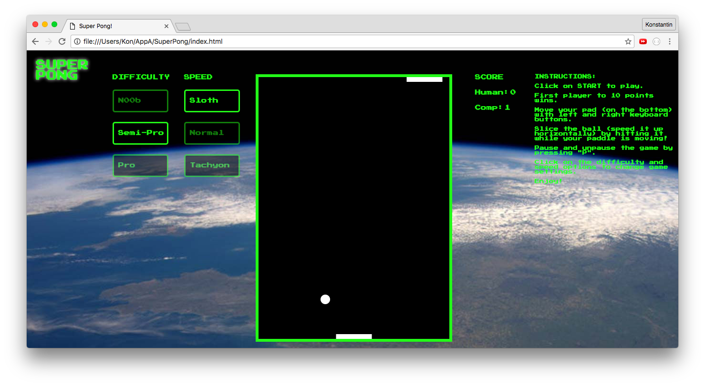

# Super Pong

###[Link to Super Pong](http://preacher-wolf-83250.bitballoon.com/)

This project is an implementation of the classic video game Pong, with bonus features.

The game was developed using Javascript, Canvas, and HTML/CSS.

## Features

- [ ] Playable version of the classic Pong video game.

- [ ] Game
  - [ ] Game board designed using Canvas
  - [ ] Player can control the paddle by moving it left and right
  - [ ] Unlike original game, hitting the ball while paddle is moving will "slice/spin" it, meaning speed it up in the direction the paddle is moving.
  - [ ] Ball bounces off side walls
  - [ ] Points are scored when player misses ball with paddle and it flies off the screen.
  - [ ] Ball is served in random direction to one of the players
  - [ ] Setting choices include 3 difficulty levels and 3 speed options.
  - [ ] Pressing "P" pauses the game loop.
  - [ ] 10 points wins the game and player can restart the game.

## Views




####Sample Code Snippet:

######Computer Difficulty Control

```javascript

if(ballY < canvas.height*aiHeightMultiplier &&
  ballDY < 0 ){
  if(ballX > paddleX + paddleWidth/2 - 1 &&
    ballX < paddleX + paddleWidth/2 + 1){

  }
  else if(ballX + aiLag > compPaddleX + paddleWidth/2 &&
    compPaddleX < canvas.width-paddleWidth){
    compPaddleX += aiSpeed;
  } else if (ballX-paddleWidth - aiLag < compPaddleX &&
    compPaddleX > 0){
    compPaddleX -= aiSpeed;
  }
}

```
